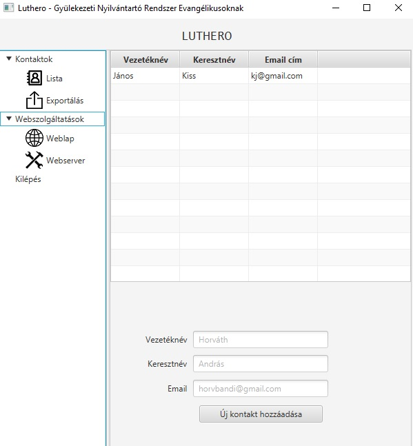

# Luthero 1.0

### Mi a szoftver célja, és melyek a funkciói?
A Luthero célja, hogy az evangélikus gyülekezetek lelkészei, presbiterei, és önkéntesei könyebben tudják menedzselni a gyülekezeti adatbázist...

### Funkciók

### A GUI

A grafikus felület (GUI) három fő részből áll : 1) egy menüből 2) egy nézet interfészből, és 3) egy szöveges részből, ahol a mért paraméterekről olvashat részletes információt a felhasználó. A „Conncection” opció alatt a „Refresh” gomb megnyomásával tud a felhasználó új mérést végezni.

### Használati útmutató a felhasználónak
 A /dist mappában futtassa a Luthero.jar nevű fájlt.
 
### További fejlesztések
A korábban írtak szerint még szeretném jelen alkalmazásom funkcióit bővíteni két funkcióval, melyek az akkumulátor feszültségét mérik, továbbá amely a CPU hőmérsékletéről ad információkat.

